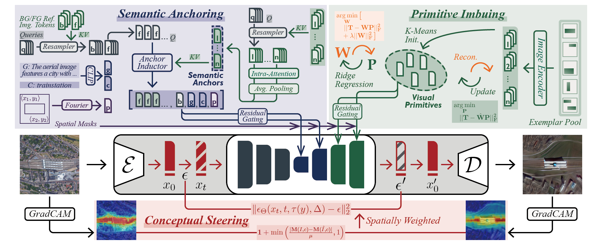

# Envisioning Beyond the Few: Disentangled Semantics and Primitives for Few-Shot Atypical Layout-to-Image Generation

**ICML 2026**

**Authors:** Nan Bao, Yifan Zhao, Wenzhuang Wang, Jia Li



## Environment Setup

We use two separate environments:

1. **Main environment** for core training and inference.

    ```bash
    conda create -n dsp python=3.10.20
    conda activate dsp
    pip install torch==2.6.0 torchvision==0.21.0 torchaudio==2.6.0 --index-url https://download.pytorch.org/whl/cu126
    pip install datasets==4.8.5 pillow==12.2.0 accelerate==1.13.0 transformers==5.8.1 diffusers==0.38.0 safetensors==0.8.0rc0 tensorboard==2.20.0 opencv-python==4.13.0.92 einops==0.8.2 imagesize==2.0.0 peft==0.19.1 ttach==0.0.3 ftfy==6.3.1 albumentations==2.0.8
    ```

2. **Evaluation environment** for MMDetection/MMEngine compatibility. It is used for evaluation with MMDetection/MMEngine due to strict version constraints, and also supports YOLO-based evaluation.

    ```bash
    conda create -n dsp-eval python=3.10.20
    conda activate dsp-eval
    conda install mkl==2023.1.0 numpy==1.26.4
    conda install pytorch==2.1.2 torchvision==0.16.2 torchaudio==2.1.2 pytorch-cuda=12.1 -c pytorch -c nvidia
    pip install mmengine==0.10.7 tqdm==4.67.3 shapely==2.1.2 scipy==1.15.3 terminaltables==3.1.10 ultralytics==8.4.50 pycocotools==2.0.11 https://download.openmmlab.com/mmcv/dist/cu121/torch2.1.0/mmcv-2.1.0-cp310-cp310-manylinux1_x86_64.whl "numpy<2.0.0" "setuptools<70.0.0"
    ```

## Set Environment Variables

Set the root path of this project:

```bash
export DSP_PROJECT_DIR=/path/to/DSP # replace with the actual path
```

It is recommended to add this line to `~/.bashrc` or `~/.zshrc` for persistence.

## Pretrained Models Preparation

1. We use several pretrained models as external dependencies. Please download them manually from the following sources:
    - [stable-diffusion-v1-5](https://huggingface.co/stable-diffusion-v1-5/stable-diffusion-v1-5)
    - [clip-vit-large-patch14](https://huggingface.co/openai/clip-vit-large-patch14)
    - [dinov2_vitl14_pretrain.pth](https://dl.fbaipublicfiles.com/dinov2/dinov2_vitl14/dinov2_vitl14_pretrain.pth)
    - [ViT-B-16.pt](https://openaipublic.azureedge.net/clip/models/5806e77cd80f8b59890b7e101eabd078d9fb84e6937f9e85e4ecb61988df416f/ViT-B-16.pt)

2. After downloading, organize the pretrained weights under `./pretrained` as follows:

    ```bash
    pretrained
    ├── stable-diffusion-v1-5
    │   └── ...
    ├── clip-vit-large-patch14
    │   └── ...
    ├── dinov2_vitl14_pretrain.pth
    └── ViT-B-16.pt
    ```

    You may either copy or symlink the files. We recommend using symbolic links:

    ```bash
    ln -s /path/to/stable-diffusion-v1-5 ./pretrained/stable-diffusion-v1-5
    ln -s /path/to/clip-vit-large-patch14 ./pretrained/clip-vit-large-patch14
    ln -s /path/to/dinov2_vitl14_pretrain.pth ./pretrained/dinov2_vitl14_pretrain.pth
    ln -s /path/to/ViT-B-16.pt ./pretrained/ViT-B-16.pt
    ```

## Data Preparation

1. We use several public datasets. Please download them manually from the following sources:

    - [DIOR](https://gcheng-nwpu.github.io/#Datasets)
    - [RUOD](https://github.com/xiaoDetection/RUOD)
    - [ExDark](https://github.com/cs-chan/Exclusively-Dark-Image-Dataset/tree/master/Dataset)

2. Unzip the downloaded datasets and organize the external dataset directories as follows:

    ```bash
    DIOR-VOC
    ├── Annotations
    │   ├── Horizontal_Bounding_Boxes
    │   └── Oriented_Bounding_Boxes
    └── VOC2007
        ├── ImageSets
        │   ├── Layout
        │   ├── Main
        │   └── Segmentation
        └── JPEGImages
    ```

    ```bash
    RUOD
    ├── Environment_pic
    │   ├── blur
    │   ├── color
    │   └── light
    ├── Environmet_ANN
    ├── RUOD_ANN
    └── RUOD_pic
        ├── test
        └── train
    ```

    ```bash
    ExDark
    ├── annos
    ├── imageclasslist.txt
    └── images
    ```

3. Run data preprocessing scripts located in `./scripts/data_process`, after updating all hard-coded paths (e.g., `/path/to/DIOR_VOC`, `/path/to/RUOD`, `/path/to/ExDark`) in the scripts to match the local setup. Execute them in order.

    The preprocessing outputs will be generated under `./data` with the following structure:

    ```bash
    data
    ├── DIOR
    │   ├── dior_emb.pt
    │   ├── images -> /path/to/DIOR-VOC/VOC2007/JPEGImages
    │   ├── metadatas
    │   └── patches
    ├── EXDARK
    │   ├── exdark_emb.pt
    │   ├── images
    │   ├── metadatas
    │   └── patches
    └── RUOD
        ├── images -> /path/to/RUOD/RUOD_pic
        ├── metadatas
        ├── patches
        └── ruod_emb.pt
    ```

## Training and Inference

We provide three example configurations in `./configs`: `dsp-dior.yaml`, `dsp-ruod.yaml`, and `dsp-exdark.yaml`.

> **Argument Description:**
> - **config:** configuration file for model and dataset setup.
> - **metaseed:** seed generator identifier for deterministic sampling.
> - **num_seed:** number of sampling seeds for few-shot evaluation.
> - **k_shot:** number of samples per category in few-shot setting.
> - **run_id:** identifier for different runs.
> - **gpu_ids:** GPU device indices for execution.
> - **iter:** number of bootstrap iterations for FID.

### Base Phase Training

```bash
bash train_base.sh --config "dsp-dior"
bash train_base.sh --config "dsp-ruod"
bash train_base.sh --config "dsp-exdark"
```

### Novel Phase Training

```bash
bash train_novel.sh --config "dsp-dior" --metaseed "aaa" --num_seed 50 --k_shot "5" --run_id "1" --gpu_ids "0,1,2,3"
bash train_novel.sh --config "dsp-ruod" --metaseed "aaa" --num_seed 50 --k_shot "5" --run_id "1" --gpu_ids "0,1,2,3"
bash train_novel.sh --config "dsp-exdark" --metaseed "aaa" --num_seed 50 --k_shot "5" --run_id "1" --gpu_ids "0,1,2,3"
```

### Inference

```bash
bash infer.sh --config "dsp-dior" --metaseed "aaa" --num_seed 50 --k_shot "5" --run_id "1" --ckpt "100" --gpu_ids "0,1,2,3" --max_infer_size 50
bash infer.sh --config "dsp-ruod" --metaseed "aaa" --num_seed 50 --k_shot "5" --run_id "1" --ckpt "100" --gpu_ids "0,1,2,3" --max_infer_size 50
bash infer.sh --config "dsp-exdark" --metaseed "aaa" --num_seed 50 --k_shot "5" --run_id "1" --ckpt "100" --gpu_ids "0,1,2,3" --max_infer_size 50
```

## Evaluation

### Preparation

Download the YOLO and Faster R-CNN weights from [this link](https://drive.google.com/drive/folders/1FWN02KEuGPdEkXv38MmT8-D4-uQcAn4_?usp=sharing). Place them under `./pretrained`. The expected directory structure is as follows:

```bash
pretrained
├── evaluation
│   ├── mmdet
│   │   ├── faster_rcnn_r50_fpn_1x-dior
│   │   │   └── epoch_12.pth
│   │   ├── faster_rcnn_r50_fpn_1x-exdark
│   │   │   └── epoch_12.pth
│   │   └── faster_rcnn_r50_fpn_1x-ruod
│   │       └── epoch_12.pth
│   └── yolo
│       └── best.pt
└── ... (pretrained models for training)
```

### YOLO (mAP / AP50 / AP75)

> **Note:** In yolo-wrapper-dior.sh, the `--xml_folder` path should be set to the DIOR annotation directory (`/path/to/DIOR-VOC/Annotations/Horizontal_Bounding_Boxes`).

```bash
cd $DSP_PROJECT_DIR/scripts/evaluation/yoloscore-dior
bash yolo-wrapper-dior.sh --config "dsp-dior" --metaseed "aaa" --num_seed 50 --ckpt "100" --k_shot "5" --run_id "1" --gpu_ids 0
```

### Faster R-CNN (mAP / AP50 / AP75)

```bash
cd $DSP_PROJECT_DIR/scripts/evaluation/FasterRCNN_score-mmdet
bash test-wrapper-dior.sh --config "dsp-dior" --metaseed "aaa" --num_seed 50 --ckpt "100" --k_shot "5" --run_id "1" --gpu_ids 0
bash test-wrapper-ruod.sh --config "dsp-ruod" --metaseed "aaa" --num_seed 50 --ckpt "100" --k_shot "5" --run_id "1" --gpu_ids 0
bash test-wrapper-exdark.sh --config "dsp-exdark" --metaseed "aaa" --num_seed 50 --ckpt "100" --k_shot "5" --run_id "1" --gpu_ids 0
```

### Bootstrap FID

```bash
cd $DSP_PROJECT_DIR/scripts/evaluation/bootstrap_fid
python boot_fid-dior.py --config dsp-dior -run_id 1 -num_seeds 50 --iter 50 --k_shot 5
python boot_fid-ruod.py --config dsp-ruod -run_id 1 -num_seeds 50 --iter 50 --k_shot 5
python boot_fid-exdark.py --config dsp-exdark -run_id 1 -num_seeds 50 --iter 50 --k_shot 5
```

Bootstrap FID results will be saved under `./metrics/BootstrapFID`.

### Detection Metric Summarization

```bash
cd $DSP_PROJECT_DIR/scripts/evaluation/summarize
bash summarize-wrapper.sh --config "dsp-dior" --k_shot "5" --run_id "1" --ckpt "100" --metaseed "aaa" --num_seed 50
bash summarize-wrapper.sh --config "dsp-ruod" --k_shot "5" --run_id "1" --ckpt "100" --metaseed "aaa" --num_seed 50
bash summarize-wrapper.sh --config "dsp-exdark" --k_shot "5" --run_id "1" --ckpt "100" --metaseed "aaa" --num_seed 50
```

Detection evaluation results (mAP / AP50 / AP75, YOLO and Faster R-CNN) will be summarized in `./metrics`.

## Acknowledgement

Our work is based on [stable diffusion](https://github.com/compvis/stable-diffusion), [diffusers](https://github.com/huggingface/diffusers), [CLIP](https://github.com/openai/CLIP), [DINOv2](https://github.com/facebookresearch/dinov2), [CC-Diff](https://github.com/AZZMM/CC-Diff), [MIGC](https://github.com/limuloo/MIGC), [GradCAM](https://github.com/linyq2117/CLIP-ES), and [kmeans_pytorch](https://github.com/subhadarship/kmeans_pytorch). Thanks for these great projects!

## Citation

If you find our work useful for your research, please cite the following paper.

```bib
@inproceedings{
    bao2026envisioning,
    title={Envisioning Beyond the Few: Disentangled Semantics and Primitives for Few-Shot Atypical Layout-to-Image Generation},
    author={Bao, Nan and Zhao, Yifan and Wang, Wenzhuang and Li, Jia},
    booktitle={Forty-third International Conference on Machine Learning},
    year={2026},
    url={https://openreview.net/forum?id=Jva4wVEySO}
}
```